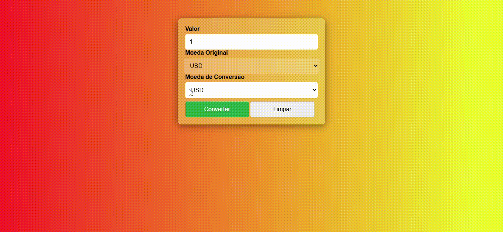

# Conversor de Moeda API

## Índice

- [Introdução](#introdução)
- [Descrição](#descrição)
- [Arquitetura do Código](#arquitetura-do-código)
- [Responsividade](#responsividade)
- [Funcionamento](#funcionamento)
- [Funcionalidades](#funcionalidades)
- [Como Usar](#como-usar)
- [JavaScript](#javascript)
- [Tecnologias Utilizadas](#tecnologias-utilizadas)
- [Problemas Comuns](#problemas-comuns)
- [Autor](#autor)

---

## Introdução

O **Conversor de Moeda API** é uma aplicação web que permite aos usuários converter valores entre diversas moedas, utilizando taxas de câmbio em tempo real. O aplicativo oferece uma interface intuitiva e simples para quem precisa de uma ferramenta rápida e eficaz para conversões de moeda. A aplicação integra-se com a API [Exchangerate](https://www.exchangerate-api.com/), garantindo que as taxas de câmbio estejam sempre atualizadas.

---

## Descrição

A aplicação possibilita ao usuário inserir um valor em uma moeda específica (BRL, USD, EUR), selecionar a moeda de origem e a moeda de destino, e obter o valor convertido em tempo real. A taxa de câmbio utilizada é obtida diretamente da API Exchangerate, que é acessada automaticamente sempre que uma conversão é realizada. 

Com isso, o **Conversor de Moeda API** fornece uma solução prática e eficiente para quem precisa fazer conversões de forma rápida, seja para viagens, negócios ou outros fins.

---

## Arquitetura do Código

A arquitetura segue o padrão tradicional de desenvolvimento de aplicações web:

- **HTML**: Define a estrutura da interface de usuário, incluindo os campos de entrada de valor e seleção de moedas.
- **CSS**: Responsável pela aparência, com foco em um design moderno e responsivo.
- **JavaScript**: Realiza a lógica de interação, cálculo da conversão de moeda e comunicação com a API externa.
  
Essas camadas trabalham de maneira integrada, garantindo uma experiência fluida e intuitiva para o usuário.

---

## Responsividade

A aplicação foi projetada para ser **100% responsiva**, utilizando técnicas de CSS modernas, garantindo que ela funcione perfeitamente em dispositivos de diferentes tamanhos de tela (desktop, tablet e smartphones). A interface adapta-se dinamicamente a diferentes resoluções para garantir que a experiência do usuário seja sempre otimizada, independentemente do dispositivo utilizado.

---

## Funcionamento

1. **Entrada de Dados**:
   - O usuário insere o valor que deseja converter.
   - Escolhe a moeda de origem (BRL, USD, EUR).
   - Seleciona a moeda de destino (BRL, USD, EUR).

2. **Cálculo da Conversão**:
   - Ao clicar no botão "Converter", a aplicação faz uma requisição à API Exchangerate para obter a taxa de câmbio atualizada.
   - O valor informado pelo usuário é multiplicado pela taxa de câmbio da moeda de origem para a moeda de destino.

3. **Exibição do Resultado**:
   - O resultado da conversão é exibido na página, mostrando o valor convertido com o código da moeda de destino.

4. **Limpeza de Dados**:
   - O botão "Limpar" reseta os campos de entrada, permitindo que o usuário inicie uma nova conversão.

---

## Funcionalidades

- **Entrada de Valor**: O usuário pode inserir o valor desejado para conversão de moeda.
- **Seleção de Moeda Original**: Permite que o usuário escolha entre BRL, USD ou EUR como moeda de origem.
- **Seleção de Moeda de Conversão**: O usuário pode escolher a moeda de destino para conversão (BRL, USD ou EUR).
- **Conversão Automática**: A taxa de câmbio é obtida automaticamente via API, e o valor convertido é mostrado imediatamente na tela.
- **Exibição de Resultado**: O resultado da conversão é exibido ao usuário de forma clara e objetiva.
- **Limpeza de Campos**: O botão "Limpar" permite que o usuário reinicie a aplicação, facilitando a realização de novas conversões.

---

## Como Usar

1. **Digite o valor**: No campo "Valor", insira o valor que você deseja converter.
2. **Escolha a moeda original**: Selecione a moeda de origem (por exemplo, BRL).
3. **Escolha a moeda de destino**: Selecione a moeda para a qual você deseja converter (por exemplo, USD).
4. **Clique em "Converter"**: O valor convertido será mostrado imediatamente abaixo.
5. **Limpar**: Clique no botão "Limpar" para resetar os campos e começar uma nova conversão.

---

## JavaScript

A lógica da aplicação é implementada com JavaScript, utilizando os seguintes processos:

- **Obtenção da Taxa de Câmbio**: A função `getExchangeRate()` faz uma requisição à API Exchangerate para obter as taxas de câmbio em tempo real.
- **Cálculo da Conversão**: Uma vez que a taxa de câmbio é recebida, o valor fornecido pelo usuário é multiplicado pela taxa para determinar o valor convertido.
- **Exibição de Resultados**: O resultado da conversão é mostrado na interface, e a função exibe o valor final de forma formatada.
- **Tratamento de Erros**: Caso haja falhas na comunicação com a API ou outros problemas, uma mensagem de erro é apresentada ao usuário.

---

## Tecnologias Utilizadas

* [<code></code>](https://developer.mozilla.org/pt-BR/docs/Web/HTML)
* [<code></code>](https://developer.mozilla.org/pt-BR/docs/Web/CSS)
* [<code></code>](https://developer.mozilla.org/pt-BR/docs/Web/JavaScript)
* [<code></code>](https://git-scm.com/)
* [<code></code>](https://code.visualstudio.com/)
* [<code></code>](https://github.com/)
  
---

## Problemas Comuns

- **Erro ao Buscar Taxa de Câmbio**: Caso a API esteja temporariamente fora do ar, ou haja algum problema de rede, o sistema não conseguirá realizar a conversão. Verifique sua conexão de internet e tente novamente mais tarde.
- **Taxa de Câmbio Desatualizada**: Embora a API forneça taxas de câmbio em tempo real, pode haver um pequeno atraso na atualização em momentos de alta demanda.

---

## Autor

**Rafael Souza Mastellini** - 2-C

Você pode entrar em contato comigo ou acompanhar meus projetos através das seguintes redes sociais:

- [GitHub](https://github.com/SouzaRafael7)

---

Com este **Conversor de Moeda API**, você pode realizar conversões de forma rápida e fácil, com a certeza de estar utilizando dados atualizados diretamente de uma fonte confiável. Se encontrar algum erro ou tiver sugestões de melhorias, fique à vontade para contribuir com o projeto!